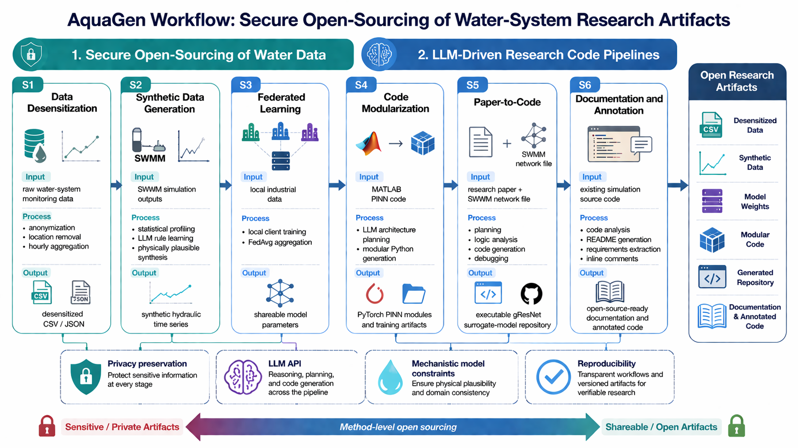

# AquaGen

AquaGen is a demonstration repository for open-source workflows in water-system research. It shows how sensitive urban drainage data, mechanistic model outputs, research code, and paper-derived methods can be transformed into shareable artifacts with help from large language models (LLMs).



The repository is organized into six scenarios:

- **S1**: desensitize low-sensitivity monitoring data.
- **S2**: generate physically plausible synthetic SWMM time series.
- **S3**: build a shareable federated-learning model from local industrial data.
- **S4**: convert a MATLAB PINN example into modular Python code.
- **S5**: run a paper-to-code pipeline for a physics-guided UDS surrogate model.
- **S6**: generate open-source documentation and inline comments for simulation code.

## Repository Layout

```text
AquaGen/
|-- S1/                       # Data desensitization
|   |-- S1.py
|   |-- data/
|   `-- results/
|-- S2/                       # SWMM-based synthetic data generation
|   |-- S2.py
|   |-- data/
|   `-- results/
|-- S3/                       # Federated-learning example
|   |-- federated_learning_example.py
|   |-- federated_learning_example_v2.py
|   |-- original_data.csv
|   `-- federated_model*.pth
|-- S4/                       # MATLAB PINN to modular Python
|   |-- S4.py
|   |-- data/
|   `-- results/
|-- S5/                       # Paper-to-code pipeline
|   |-- S5_P2C.py
|   |-- data/
|   `-- results_P2C/
`-- S6/
    |-- case1/                # Documentation and annotation generation
    `-- case2/                # Reserved placeholder
```

## Requirements

Python 3.10+ is recommended. The examples use the OpenAI-compatible DeepSeek API through the `openai` Python SDK. Replace the placeholder API key in the scripts before running LLM-driven workflows.

Common packages:

```bash
pip install openai pandas numpy matplotlib torch scikit-learn scipy pyyaml
```

Scenario-specific packages:

```bash
pip install pyswmm networkx
```

`pyswmm` is required for SWMM extraction and simulation workflows in S2 and S5. CUDA is optional, but useful for the PyTorch training examples in S3, S4, and S5.

## Notes on Reproducibility and Safety

- The scripts contain placeholder API keys (`sk-xxxxxxxx...`). Replace them locally before running LLM-driven workflows.
- Generated files already exist in the repository for most scenarios, so readers can inspect expected outputs without rerunning API calls.
- SWMM binary/model outputs (`.out`, `.rpt`), PyTorch checkpoints (`.pth`), PNG figures, PDF files, and pickle state files are included as artifacts.
- S1 and S2 demonstrate data release alternatives: anonymized aggregation for lower-sensitivity data and synthetic generation for more sensitive hydraulic time series.
- S5 demonstrates method-level open sourcing: when original industrial code cannot be released, the paper method can still be translated into an executable, inspectable research framework.

## Keywords
- https://github.com/sxLii/AquaGen/blob/master/keywords.html
